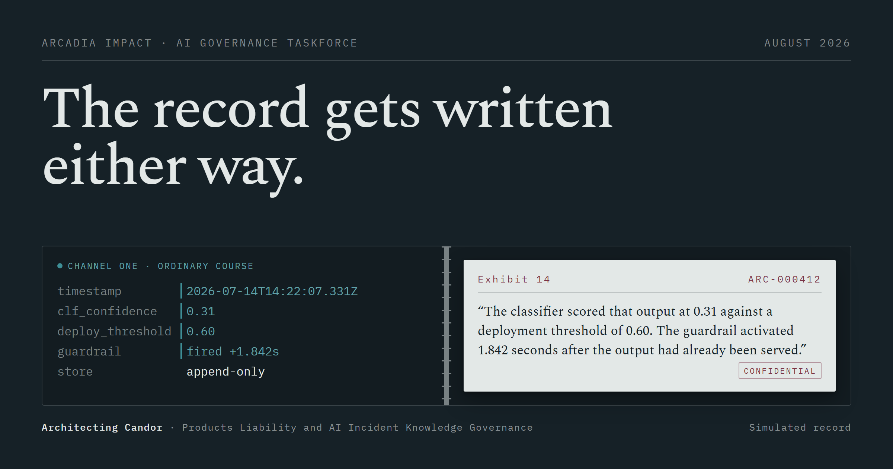

# Architecting Candor — interactive explainer

### **[architecting-candor.vercel.app →](https://architecting-candor.vercel.app)**

Companion site to *Architecting Candor: Products Liability and AI Incident Knowledge Governance* (Celone, McGregor, Secret, Mignot, Bregman & Alikhanov; Arcadia Impact AI Governance Taskforce, August 2026).



The paper argues that AI firms are caught in a **documentation paradox**. Regulation and fiduciary duty compel them to write safety incidents down; American civil discovery lets plaintiffs compel production of exactly those documents. The result is that the knowledge which would make systems safer is systematically not recorded.

Its answer is a **mechanism** — a three-channel Safety Translation Layer. So this site does not explain the mechanism. It runs it.

---

## What you can actually do here

| | |
|---|---|
| **Route an incident** | Fifteen artifacts from an unfolding incident, four channels to put them in — including *Do not write it down*, the strategy most readers arrive believing in. Two scoreboards grade the result and pull against each other: what a plaintiff can get, and what an engineer can still fix. Every privilege outcome names the authority it rests on. |
| **Operate the valve** | Push a causal conclusion outward through the one-way valve and watch it refuse, with the doctrinal reason stated. Thirteen distinct refusals; every flow the paper permits actually works. |
| **Calibrate a tripwire** | Seven threshold bands against a seeded quarter of synthetic traffic. Collapse the logging tier and watch near-miss capture collapse with it while escalations hold steady — the move a regime designed under legal fear makes first. |
| **Lint a real ticket** | Paste your own incident ticket. Five categories of phrasing that would read as the firm's own findings, each with a measurement-form substitute. Runs entirely in your browser — [`/linter`](https://architecting-candor.vercel.app/linter) is shareable on its own. |
| **Print the checklist** | §08 prints to exactly one page, so it can go to a general counsel on paper. |

Ten numbered sections. Above 82rem a rail marks where you are; below that the same list opens from a control in the corner.

---

## The discipline this repository is really about

The site can only be linked from the paper if every claim on it survives scrutiny. Two mechanisms enforce that, and both are the interesting part of this codebase.

### 1. Content integrity

1. **Every factual claim, case name, statute citation, date, figure and quotation traces to the paper.** No facts from elsewhere, no updated case law, no invented statistics.
2. **Anything the paper does not supply is marked on the screen that shows it**, never in a footnote. Three provenance marks, rendered by [`src/components/Provenance.tsx`](src/components/Provenance.tsx):
   - `simulated` — synthetic data written for this page (the incident, the artifact deck, the event stream)
   - `illustrative` — a value the paper does not give (every threshold band)
   - `paper` — traceable to the source, with a section reference
3. **Privilege defensibility is a qualitative band, never a percentage.** The paper supports no number there.
4. Nothing on the site is legal advice, and it says so.

### 2. Suites that fail when an argument breaks

Four scripts assert the interactives still make the arguments they were built to make. They run against the content files, so a copy edit that quietly guts a claim fails loudly instead of shipping.

```bash
pnpm check
```

- **`check-grading`** — routing everything through counsel must still be pierced more often than withheld; writing nothing must still produce the auto-captured telemetry, still lose the human record, and still raise a spoliation risk; the three-channel routing must still reach 7/7 remediation with no failed privilege claim.
- **`check-valve`** — at least four distinct illegal flows refused with a stated doctrinal reason (there are thirteen), every permitted flow actually permitted, nothing able to overwrite the pre-remediation state, and no causal or fault work able to escape Channel Two by any route.
- **`check-tripwire`** — collapsing the logging tier must visibly destroy near-miss capture without changing how often counsel is engaged; bands at maximum must miss real signals; the recommended shape must read as pre-committed.
- **`check-linter`** — all five categories exercised by the example, segments reconstruct the input exactly, word boundaries respected, measurement-language text returns clean.

---

## Local development

```bash
pnpm install
pnpm dev
```

Requires **pnpm** and **Node 24**. No backend, no database, no API key, no environment variable — the site is entirely static and every interactive computes in the browser.

| Command | What it does |
|---|---|
| `pnpm dev` | Dev server with HMR |
| `pnpm build` | Typecheck, then production build to `dist/` |
| `pnpm preview` | Serve the production build |
| `pnpm typecheck` | TypeScript, strict, no emit |
| `pnpm lint` | Biome — lint and format check |
| `pnpm check` | The four content-integrity suites above |
| `pnpm read:aloud` | Every user-facing string as one document, for the tone check |
| `pnpm og` | Regenerate `public/og.png` and `public/favicon.svg` from the token layer |

These three drive a real headless browser, so they need the production build already being served — run `pnpm build && pnpm preview` in another shell first. They are deliberately **not** part of `pnpm check`, which stays server-free.

| Command | What it does |
|---|---|
| `pnpm check:lighthouse` | Performance and accessibility, gated at 95, on mobile **and** desktop |
| `pnpm check:keyboard` | Drives all 22 interactives with real key events, at 1440 and again at 390 |
| `pnpm audit:a11y` | axe-core over every section, with all deferred content force-mounted |

---

## Editing the content

**All prose, case data, artifact text, rules and thresholds live in [`src/content/`](src/content). Nothing substantive lives in a component.** An author can rewrite any sentence on the site without opening a `.tsx` file. Grepping the components for a capitalised English phrase returns nothing, and that is the intended state.

That includes strings a reader never sees. The accessible names — what a screen reader speaks for the seam, the sliders, the two charts and every control in Route the Record — live in the `a11y` block of `src/content/ui.ts` as functions taking their interpolations. They are prose someone hears, so they go through `pnpm read:aloud` with everything else instead of hiding in a template literal.

| File | Section |
|---|---|
| `site.ts` | Metadata, citation, disclaimer, the About block, the section register |
| `hero.ts` | 00 · The memo, and the double-read incident record |
| `pincer.ts` | 01 · The two forces |
| `timeline.ts` | 01 · Reclassification entries and the 9 December 2026 countdown |
| `signal.ts` | 02 · Translation loss, normalization of deviance, the decision to record |
| `artifacts.ts` | 03 · The fifteen-artifact deck and the per-artifact privilege rulings |
| `grading.ts` | 03 · Discovery outcomes, flags, the four strategies |
| `channels.ts` | 04 · Nodes, objects, arrows and every valve rule |
| `thresholds.ts` | 05 · The seven bands, the recommended shape, the defensibility bands |
| `regimes.ts` | 06 · The four comparative regimes and the target row |
| `statute.ts` | 07 · The four statutory principles and the four protections |
| `linter-rules.ts` | 08 · Linter categories, phrases, substitutes, the ticket template |
| `checklist.ts` | 08 · The printable implementation checklist |
| `ui.ts` | Cross-cutting interface copy and every accessible name |

---

## Architecture

```
src/
  content/      All prose and data. Edit here.
  components/   Seam, Scaffold, ArguesBlock, SectionHead, SectionNav,
                Provenance, Deferred
  modules/      One directory per section
  lib/          grade.ts, valve.ts, tripwire.ts, lint.ts, prng.ts, countdown.ts
  styles/       tokens.css, base.css, seam.css, components.css, print.css,
                notfound.css
scripts/        Verification suites, Lighthouse gate, screenshot tooling, OG renderer
docs/           reference-audit.md, design-plan.md
404.html        A real error page, built as a second Vite entry
```

**Design.** Two incompatible document systems sharing one surface. The page ground is always the engineering console; the legal register appears only as bounded, stamped **document objects** sitting on it — which is the paper's own power relationship, facts as the substrate and legal judgment as a space carved out of it. The signature element is **the seam**, not a divider but the one-way valve, and it appears only where a boundary genuinely exists in the argument. The full design plan, its self-critique, and the later widescreen revision are in [`docs/design-plan.md`](docs/design-plan.md).

**Colour.** Six source values in `src/styles/tokens.css`, each taken from a physical artifact in the paper's subject, expressed in OKLCH and mixed in OKLab. **No raw hex appears anywhere else in the project** — the OG card and favicon are generated by reading the token file at build time for exactly that reason. Contrast figures in the comments are worst-case across every surface a colour sits on, computed and then confirmed with axe-core rather than estimated.

**Type.** IBM Plex Mono and IBM Plex Sans for the console register, Spectral for the legal one. Self-hosted from `public/fonts` with two weights preloaded — one per side of the seam in the hero. To refresh the faces, copy them out of the `@fontsource` devDependencies and keep the filenames.

**Cascade layers.** `app-tokens → app-base → app-components → app-modules → app-print`, declared in `src/index.css`. Module stylesheets are imported from their components, so the bundler injects them in module-graph order; layers make the outcome independent of that, which is what lets the print stylesheet win without a single `!important`.

**Routing.** Two entry points, `/` and `/linter`, resolved by a pathname switch in `src/main.tsx` rather than a routing library. Both deploy configs rewrite **only** `/linter` to the SPA shell; anything else falls through to a real 404. `/linter` sets its own canonical, title and description on mount, because both routes are served from the same `index.html` and the sitemap lists them separately.

**The explainer video.** A 9½-minute video sits in §09 beside the paper links,
self-hosted so that watching it sends no request to anyone but this domain — the
same reason the linter runs in your browser. `preload="none"` and a 22 kB poster
mean nothing is fetched until you press play; verified as zero bytes on load.

The 87 MB file **is committed**. That is a deliberate trade. It was briefly kept
out of git and shipped with the deployment upload instead, which broke as soon as
it met reality: the Vercel GitHub integration rebuilds production from the
repository on every push, so a push produced a site where the video existed but
nothing on the page linked to it. One large file, added once and never modified,
is the least-bad case for git history, and it makes every build — local, CLI or
git-triggered — produce the same site.

`.vercelignore` still exists and is worth knowing about: without it the Vercel
CLI falls back to `.gitignore`. That is a sharp edge to remember before adding
anything to `.gitignore` that the deployed site actually needs.

The video has **no caption track**, which is the site's one known accessibility
gap. axe reports it as *incomplete* rather than a violation — it cannot verify
captions programmatically and asks a human to. A fabricated or empty track would
be worse than none, so there isn't one; supply a transcript and it becomes a
`.vtt` alongside the video.

**Code splitting.** Sections 02 to 07 are separate chunks, mounted by `src/components/Deferred.tsx` as the reader approaches, or immediately if they arrived at that section's anchor. §08 is deliberately eager so the checklist is printable from anywhere. Initial JS is about 80 kB gzipped across 10 chunks.

---

## Accessibility and performance

Measured against the **live production build**, three sampled runs per mobile figure.

| Route | Profile | Performance | Accessibility | Best practices | SEO |
|---|---|---|---|---|---|
| `/` | desktop | 100 | 100 | 100 | 100 |
| `/` | mobile | 99 | 100 | 100 | 100 |
| `/linter` | desktop | 100 | 100 | 100 | 100 |
| `/linter` | mobile | 99 | 100 | 100 | 100 |

`check-keyboard.mjs` drives all **22 interactives** with genuine key events dispatched through the DevTools Protocol — not synthesised React events — and asserts each instrument's own state actually changed. It mounts every deferred section first, then re-emulates a 390px viewport to reach the controls that only exist there.

`audit-a11y.mjs` forces every deferred section to mount and drives each interactive into a used state before scanning, because an untouched instrument hides most of its own markup. It reports **no axe-core violations** across WCAG 2.0/2.1 A and AA plus best-practice rules, and prints axe's *incomplete* results too — those are where a contrast fault can hide, since axe abandons the rule wherever it cannot flatten a background.

Every interactive is fully keyboard operable. `prefers-reduced-motion` collapses all durations to 1 ms and turns the valve's push-back into an immediate state change with the reason appearing at once — information is never carried by animation alone. Nothing is distinguished by colour alone: the four routing bins, the discovery outcomes, the channel identities and the linter categories each carry a label and a second visual channel.

### Screenshot and print tooling

`scripts/shot.mjs` drives Chrome over the DevTools Protocol because `--headless --window-size` clamps the layout viewport to a 500 px minimum, which silently renders narrow breakpoints at the wrong width and then crops them.

```bash
node scripts/shot.mjs <url> <out.png> [w] [h] [--mobile] [--full] [--rm]
                      [--at=<sel>] [--click=<sel>] [--eval=<js>]
                      [--print-media] [--pdf]
```

`--pdf` renders through the print stylesheet and reports the page count, which is how *"the checklist prints to one page"* is verified rather than assumed. `--print-media` applies the print rules to the live layout so they can be measured.

---

## Deployment

Fully static. Both configs are committed and either works unchanged.

- **Vercel** — `vercel.json`. Framework preset `vite`, output `dist`, rewrites for `/linter` only.
- **Netlify** — `netlify.toml`. Same publish directory, the same `/linter` rewrite, and a catch-all to `404.html` with a real 404 status.

Both set immutable caching on hashed assets and fonts, plus `X-Content-Type-Options`, `Referrer-Policy` and `X-Frame-Options`.

If the site moves to a different domain, update `meta.canonical` and `meta.linterCanonical` in `src/content/site.ts`, the `og:url` and `twitter` URLs in `index.html`, and the URLs in `public/robots.txt` and `public/sitemap.xml`.

---

## About this snapshot

The site is a dated snapshot pinned to the August 2026 paper. The paper describes its own analysis as synchronic, capturing a legal and regulatory landscape moving faster than any single document can track; that applies with more force to a web page. Case law moves, regulations commence, and the countdown on the front page will expire and switch to a "now in force" state on 9 December 2026.

The interactives are illustrative reconstructions. The incident they follow did not happen, the artifacts were written for this page, and the event stream is generated in the browser from a fixed seed. None of it is drawn from any real firm, product or matter.

Nothing on the site is legal advice. Firms should consult counsel before relying on any legal principle described.

---

## Licence

Two licences, because this repository holds two different things.

| What | Licence |
|---|---|
| Software — components, modules, `lib/`, `styles/`, `scripts/`, build config | [MIT](LICENSE) |
| Written content — everything in `src/content/`, `docs/` and this README | [CC BY 4.0](LICENSE-CONTENT.md) |

Reusing the content? Credit the paper rather than this site — the citation is in [LICENSE-CONTENT.md](LICENSE-CONTENT.md).

Neither licence covers *Architecting Candor* itself. This is a companion to the paper, not a copy of it; the paper is published separately and carries its own terms. And no licence grant makes any of this legal advice.
